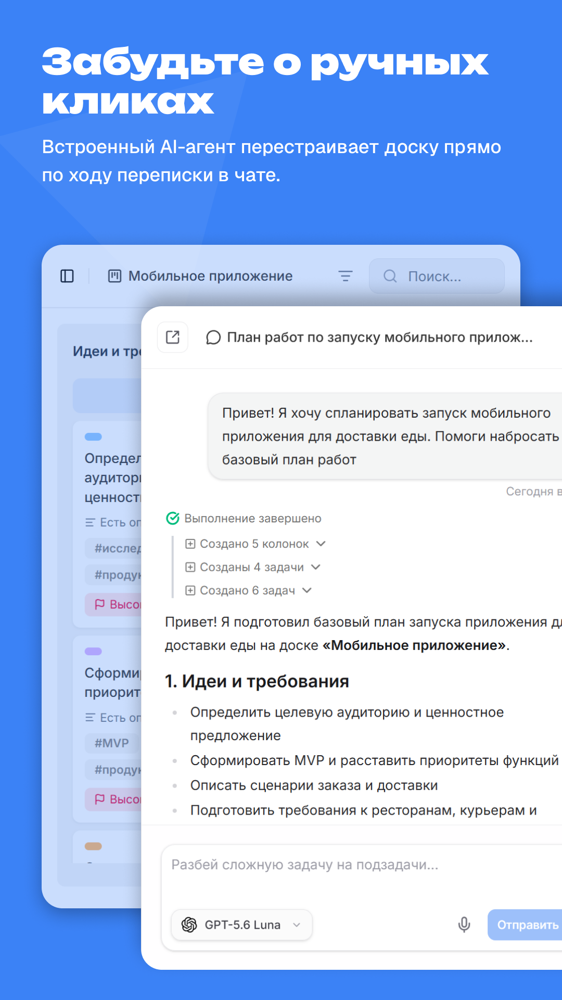
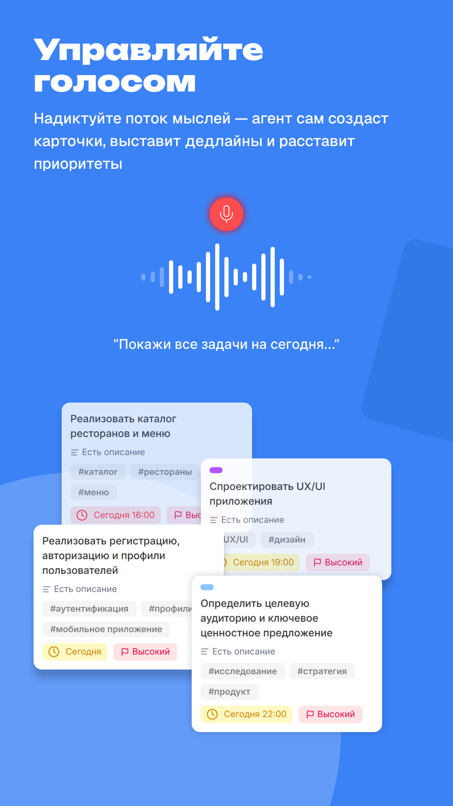
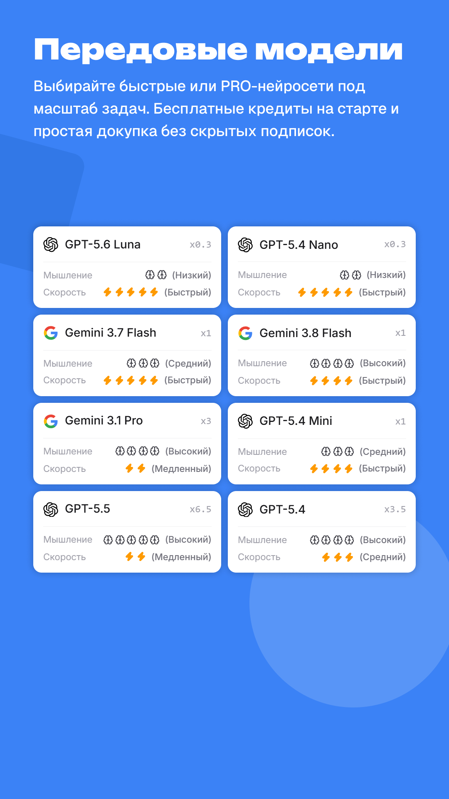
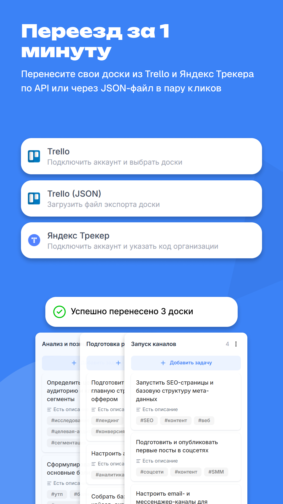

<div align="center">

# ⚡ Kanway Frontend (Web Client)

**Клиентская часть AI-управляемого таск-трекера нового поколения**  
*Автономный канбан с AI-агентом: изменение доски на лету по переписке в чате и голосовым командам*

[](https://nuxt.com/)
[](https://vuejs.org/)
[](https://www.typescriptlang.org/)
[](https://tailwindcss.com/)
[](https://www.shadcn-vue.com/)
[](https://sentry.io/)
[](https://pnpm.io/)

</div>

---

## 📸 Демонстрация и интерфейс

<div align="center">
  <h3>🎥 Видео-демонстрация работы AI-агента и голосового ввода</h3>

https://github.com/user-attachments/assets/b79dc168-a71e-42a7-a19b-477192894259


</div>

<br />

### 🖼️ Скриншоты ключевых сценариев

<table width="100%">
  <tr>
    <td width="50%" align="center">
      <b>1. Рабочее пространство и канбан-доска</b><br /><br />
      
    </td>
    <td width="50%" align="center">
      <b>2. Диалог с AI-агентом (Chat-as-UI)</b><br /><br />
      
    </td>
  </tr>
  <tr>
    <td width="50%" align="center">
      <b>3. Распознавание голоса и быстрые команды</b><br /><br />
      
    </td>
    <td width="50%" align="center">
      <b>4. Автоимпорт (Trello / Яндекс Трекер)</b><br /><br />
      
    </td>
  </tr>
</table>

---

## ✨ Ключевые архитектурные фичи

- **🎙️ Chat-as-UI & Voice-to-Action:** Паттерн диалогового управления доской. Встроенная запись аудио, передача в STT-пайплайн и мгновенная перерисовка карточек по событиям без перезагрузки страниц.
- **📋 Reactive Kanban Board:** Перетаскивание колонок и задач на базе `vuedraggable` с поддержкой WIP-лимитов, приоритетов, дедлайнов и тегов.
- **💬 Рендеринг ответов AI:** Поддержка Markdown-разметки сообщений агента через `showdown` с подсветкой синтаксиса и форматированием списков.
- **⚡ Гибридный рендеринг (Nitro Hybrid Route Rules):**
  - **SSG / Prerender:** Маркетинговые страницы (`/`, `/privacy`, `/terms`, `/cookies`) компилируются статически для мгновенной загрузки и Core Web Vitals.
  - **Client-Side SPA:** Рабочая среда (`/workspace/**`), экраны входа (`/auth/**`) и оплаты (`/payment/**`) выполняются строго на клиенте (SSR: false) для реактивности и экономии серверных ресурсов.
- **🔄 Серверный кеш и стейт-менеджмент:** Связка `@tanstack/vue-query` (`@peterbud/nuxt-query`) и `pinia 3` для дедупликации сетевых запросов и предиктивного кеширования.
- **🛡️ Мониторинг и отказоустойчивость:** Интеграция `@sentry/vue 10` для трассировки ошибок и отлова сбоев интерфейса в реальном времени.
- **🧩 Современный UI-кит:** Полная интеграция `shadcn-nuxt` + `reka-ui`, выезжающие панели `vaul-vue`, иконки `@lucide/vue` и анимации `aos`.
- **🔐 Аутентификация:** Поддержка быстрого входа через Яндекс ID (Yandex Suggest SDK) и VK ID.

---

## 🛠️ Технологический стек

| Категория | Технологии и версии |
| :--- | :--- |
| **Фреймворк** | [Nuxt 4](https://nuxt.com/) (`^4.4.4`), [Vue 3](https://vuejs.org/) (`^3.5.33`) |
| **Язык** | [TypeScript](https://www.typescriptlang.org/) (`^6.0.3`, strict mode) |
| **Стилизация** | [Tailwind CSS v4](https://tailwindcss.com/) (`@tailwindcss/vite`), `@nuxt/fonts` (Inter, Raleway, Roboto), SCSS |
| **Компоненты** | [shadcn-nuxt](https://shadcn-vue.com/), [Reka UI](https://reka-ui.com/), [Vaul Vue](https://github.com/radix-vue/vaul-vue) (Drawer), `@lucide/vue` |
| **Стейт & Запросы** | [Pinia 3](https://pinia.vuejs.org/) (`^3.0.4`), [TanStack Vue Query v5](https://tanstack.com/query) (`^5.100.9`) |
| **Формы & Схемы** | [Vee-Validate 4](https://vee-validate.logaretm.com/), [Zod 4](https://zod.dev/) (`^4.4.3`) |
| **Мониторинг** | [Sentry Vue](https://sentry.io/) (`^10.75.2`) |
| **Мультимедиа & Текст** | `plyr` (аудио/видео плеер), `showdown` (Markdown парсер), `aos` (анимации при скролле) |
| **Утилиты** | [VueUse 14](https://vueuse.org/), `dayjs`, `lodash`, `p-queue`, `axios`, `uuid` |
| **Оптимизация сборки** | `vite-plugin-compression` (Gzip `.gz`), `vite-svg-loader`, `nuxt-svgo` |
| **Пакетный менеджер** | [pnpm 11](https://pnpm.io/) (`11.22.0`) |

---

## 📂 Структура репозитория

```text
├── app/                  # Основной контекст Nuxt 4 (pages, layouts, app.vue)
├── components/           # Vue-компоненты
│   ├── ui/               # Атомарные компоненты shadcn (button, dialog, input, etc.)
│   ├── kanban/           # Доска, колонки, карточки задач (vuedraggable)
│   └── chat/             # Чат-агент, голосовой ввод, аудио-визуализатор
├── composables/          # Автоимпортируемая бизнес-логика (useAuth, useKanban, useVoice)
├── utils/                # Хелперы и утилиты форматирования
├── assets/               # SCSS/CSS-стили, анимации, переходы
├── public/               # Статика, favicon, манифест, скриншоты и медиа
├── nuxt.config.ts        # Конфигурация Nitro, Route Rules, SEO и плагинов
└── package.json          # Конфигурация зависимостей и скриптов
